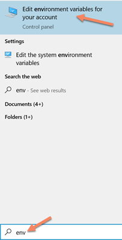

<h1>Deep Learning Based Mobile Application for Plant Disease Detection</h1>

<h2>Table Of Content</h2>

- [Introduction](#Introduction)
- [Installation in Windows](#installation-in-windows)
- [Get the Flutter SDK](#get-the-flutter-sdk)
- [Update your path](#update-your-path)
- [Run flutter doctor](#run-flutter-doctor)
- [Android Setup](#android-setup)
    - [Install Android Studio](#install-android-studio)
    - [Install Flutter Plugin In Android Studio](#install-flutter-plugin-in-android-studio)
    - [Set up the Android emulator](#set-up-the-android-emulator)
- [Download and Debug (Github) Project](#download-and-debug-github-project)
    - [Run the Emulator](#run-the-emulator)
- [Screenshots](#Screenshots)
    
<h2>Introduction</h2>

We are proposing a system which will solve farmer's issues more efficiently. We know Farmer can’t solve Farm’s complex and even small problems due to lack of perfect education. So we decided to solve this problem using the latest technology like <b>Deep Learning-Based Mobile Application</b>

</ul>

<h2>Installation in Windows</h2>
<h3>System requirements</h3>

To install and run Flutter, your development environment must meet these <b>minimum requirements</b>:

<ul>
<li>Operating Systems: Windows 7 SP1 or later (64-bit), x86-64 based</li>
<li>Disk Space: 1.32 GB (does not include disk space for IDE/tools)</li>
<li>Tools: Flutter depends on these tools being available in your environment</li>
<li>Windows PowerShell 5.0 or newer (this is pre-installed with Windows 10)</li>
<li>Git for Windows 2.x, with the Use Git from the Windows Command Prompt option</li>
</ul>

1. Go to this URL 

<pre><a href="https://flutter.dev/docs/get-started/install">https://flutter.dev/docs/get-started/install</a></pre>

2. click on Get started

 

 

3. Finally on Windows 

<h2>Get the Flutter SDK</h2>
<ul>
<li>While scrolling down, you will see a blue button with flutter latest SDK version in a zip file, just click on it</li>
  
<li>Extract the zip file and place the contained flutter in the desired installation location for the Flutter SDK (for example, C:\src\flutter)</li>
</ul>

<h2>Update your path</h2>
<ul>
<li>Just click on the extracted directory</li>
<li>Click on flutter</li>
<li>Click on bin folder</li>
<li>We need to update the PATH variable with …/flutter/bin, then only we can run flutter commands from any command prompt</li>
<li>So copy the path with <b>flutter/bin</b> like shown below</li>
  

  
<li>Search <b>env</b> on the search bar and click on <b>Edit environment variables for your account</b></li>

<li>Click on the <b>path</b> field <b>-> Edit -> New -> Paste it in the empty field</b></li>
 

 
</ul>

<h2>Run flutter doctor</h2>
<ul>
<li>Open the command prompt, and run the <code>flutter doctor</code> command</li>
<li>This command checks your environment and displays a report of the status of your Flutter installation. Check the output carefully for other software you might need to install or further tasks to perform (shown in bold text)</li>
<li>If there is any problem you will see the cross mark</li>
 

 
</ul>

<h2>Android setup</h2>
<h3>Install Android Studio</h3>
<ul>
<li>Download and install Android Studio</li>
 

<pre><a href="https://developer.android.com/studio">https://developer.android.com/studio</a></pre>

<li>Start Android Studio, and go through the Android Studio Setup Wizard. This installs the latest Android SDK, Android SDK Command-line Tools, and Android SDK Build-Tools, which are required by Flutter when developing for Android</li>
</ul>

<h3>Install Flutter Plugin In Android Studio</h3>
<ul>
<li>Open Android Studio</li>
 
<li>Click on <b>Configure</b></li>
 

  
<li>Next click on the plugins items from the drop-down menu. We have to find the flutter & Dart plugin from the marketplace. <b>Make sure you are on the marketplace tab</b></li>
<li>Then search <b>Flutter</b> and then <b>Dart</b> in the search box and press Enter</li>
<li>Click on the install button to install the flutter & dart plugin and click Restart when prompted</li>
 

 
</ul>

<h3>Set up the Android emulator</h3>

To prepare to run and test your Flutter app on the Android emulator, follow these steps:

<ul>
<li>Enable VM acceleration on your machine</li>
<li>Launch <b>Android Studio</b>, click the <b>AVD Manager</b> icon, and select <b>Create Virtual Device</b></li>

The Android submenu is only present when inside an Android project. If you do not have a project open, you can choose <b>Configure > AVD Manager</b> and select <b>Create Virtual Device</b>

<li>Choose a device definition and select Next</li>
<li>Select one or more system images for the Android versions you want to emulate, and select Next. An x86 or x86_64 image is recommended</li>
<li>Under Emulated Performance, select Hardware - GLES 2.0 to enable hardware acceleration</li>
<li>Verify the AVD configuration is correct, and select Finish</li>
<li>In Android Virtual Device Manager, click Run in the toolbar. The emulator starts up and displays the default canvas for your selected OS version and device</li>
</ul>

<h2>Download and Debug (Github) Project</h2>
<ul>
<li>Click on the Code button and select Download Zip</li>
  
 
  
 <li>Now open Android Studio and click on Open an existing Android Studio Project Now you have to find the location of your flutter project</li> 
  
 
  
    
  <li>After selecting your project, just click OK</li>
  <li>The project is ready now</li>
</ul>

<h3>Run the Emulator</h3>
<ul>
<li>Locate the main Android Studio toolbar</li>
 <li>Click on the <b>AVD Manager</b></li> 
  
 
   
  <li>Click on the Green run button then the Emulator will be started</li>
   
  
    
  <li>Go in your project folder and click on the <b>lib folder</b>. The code for your app is in <b>lib/main.dart</b>. After selecting main.dart click on the run button in Android Studio toolbar</li>
    
   
    
   <li>Finally, After the app build completes, you’ll see the starter app on your device</li>
</ul>

<h2>Screenshots</h2>

